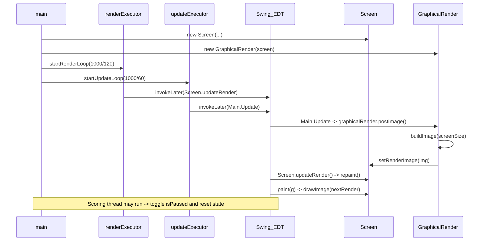

# Execution Flow — MicroWidgets Pong

This document describes the runtime execution pipeline for the Pong app, listing threads, methods and the sequence of calls that produce each frame. Use this to reason about concurrency, timing, and where to add instrumentation.

## Overview
- Two scheduled executors drive the game: a render scheduler (120 Hz target) and an update scheduler (60 Hz target).
- Both schedulers enqueue work on the Swing Event Dispatch Thread (EDT) using `SwingUtilities.invokeLater(...)`.
- The Swing EDT performs the game update and paints the latest `nextRender` image.

## Key classes
- `com.kishan.Main` — boot, update loop scheduling, game logic (`Update()`), scoring thread.
- `com.kishan.Screen` — window, render loop scheduling, `paint(...)`, `setRenderImage(...)`, `getContentSize()`.
- `com.kishan.GraphicalRender` (extends `com.kishan.common.AbstractGraphicalRender`) — builds a `BufferedImage` via `buildImage(...)`, and `postImage()` (inherited) sends it to `RenderContext`.
- `com.kishan.common.AbstractGraphicalRender` — `postImage()` uses `getScreenSize()` and `setRenderImage(...)` on the `RenderContext`.
- `Config`, `AI`, `RenderObject` — game state and helpers used during `buildImage()` and updates.

## Threads and executors
- `main` thread — constructs objects and starts loops.
- `renderExecutor` (single-thread ScheduledExecutorService) — schedules render requests at ~120 Hz.
- `updateExecutor` (single-thread ScheduledExecutorService) — schedules game updates at ~60 Hz.
- Swing EDT — executes `Main.Update()`, `Screen.updateRender()`, UI event handlers, and `paint()`.
- Scoring/reset thread — ad-hoc `new Thread(...)` used by `triggerScoringSequence()`.

## High-level sequence (per frame)
1. `renderExecutor` scheduled task runs (background thread)
   - Calls `SwingUtilities.invokeLater(Screen::updateRender)`
2. `updateExecutor` scheduled task runs (background thread)
   - Calls `SwingUtilities.invokeLater(Main::Update)`
3. Swing EDT executes `Main.Update()`
   - `graphicalRender.postImage()`
     - `AbstractGraphicalRender.postImage()` calls `buildImage(getScreenSize())` (on EDT)
     - `GraphicalRender.buildImage(...)` reads `Config` state and draws background, paddles, ball, scoreboard into a `BufferedImage`
     - `postImage()` calls `writeToContext.setRenderImage(img)` (i.e. `Screen.setRenderImage(img)`) — updates `nextRender`
   - If `isPaused` -> return early
   - `Config.Paddle.LeftPaddle.Move(...)` → update paddle positions
   - `Config.Ball.Move()` → advance physics, detect paddle/wall collisions, scoring (may call `Main.triggerScoringSequence()`)
   - `AI.update()` → update AI paddle target/behavior
   - `Config.Paddle.calculateDynamicSpeed()` → adjust speeds
   - `Config.Paddle.RightPaddle.Move(...)`
4. Swing EDT executes `Screen.updateRender()` (from render scheduler)
   - `updateRender()` calls `repaint()` (if allowed)
5. Swing EDT executes `Screen.paint(Graphics g)`
   - Draws the latest `nextRender` (image set earlier) onto the window

Notes:
- Both the render and update schedulers only enqueue work on the EDT — the expensive image creation (`buildImage`) is intentionally performed on the EDT (keeps all UI/state mutations on one thread but may block responsiveness).
- `triggerScoringSequence()` runs on its own thread and flips `isPaused` with timed sleeps; state resets happen from that thread (race potential with EDT reads/writes).

## Call graph (linear view)
- `Main.main()` → constructs `Screen`, `GraphicalRender`, sets `Config` state
- `Main.startUpdateLoop()` (updateExecutor) → schedules `SwingUtilities.invokeLater(Main::Update)`
- `Main.Update()` (EDT) → `graphicalRender.postImage()` → `buildImage(...)` → `writeToContext.setRenderImage(img)`
- `Screen.startRenderLoop()` (renderExecutor) → schedules `SwingUtilities.invokeLater(Screen::updateRender)`
- `Screen.updateRender()` (EDT) → `repaint()` → `Screen.paint()` → draws `nextRender`

## Mermaid sequence diagram

## Concurrency considerations / suggestions
- Move `buildImage(...)` off the EDT if you need smoother UI responsiveness: build the image on a background thread and `invokeLater` to set the image reference on the EDT.
- Avoid sleeping on the EDT (there are none in current flow), and consider replacing `new Thread` + `sleep` in `triggerScoringSequence()` with a scheduled executor to keep timing centralized.
- Synchronize shared state modifications from the scoring thread (or perform resets via `SwingUtilities.invokeLater(...)`) to avoid races with EDT reads.

## File locations
- `pong/src/main/java/com/kishan/Main.java`
- `pong/src/main/java/com/kishan/Screen.java`
- `pong/src/main/java/com/kishan/GraphicalRender.java`
- `common/src/main/java/com/kishan/common/AbstractGraphicalRender.java`

---
Generated on: 2026-06-03
